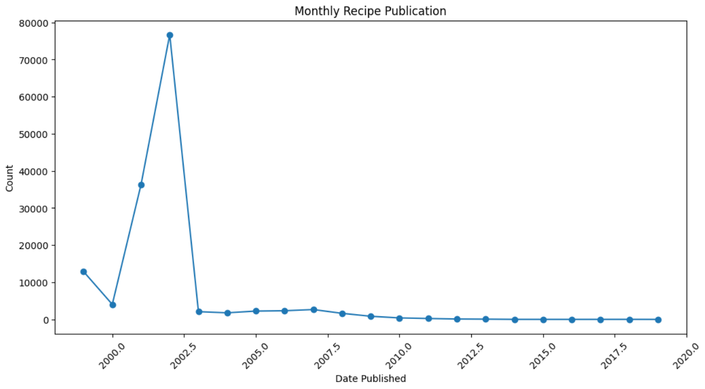
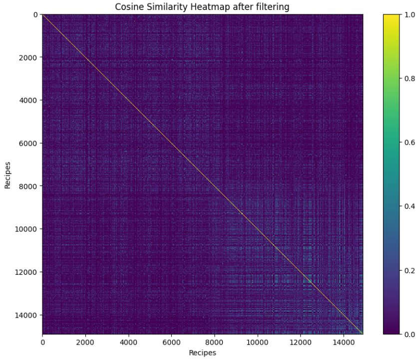
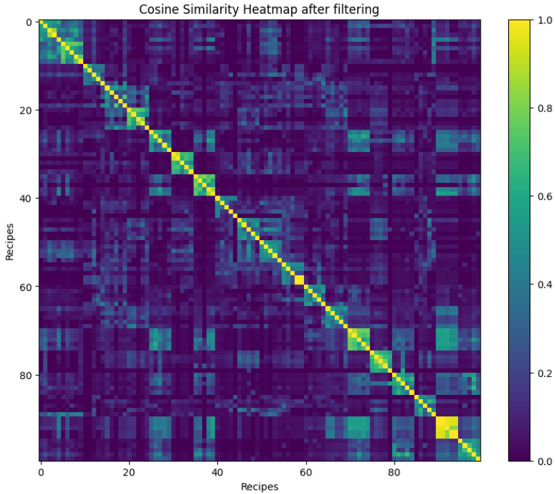

# Cuisine Recommendation System

## Overview
This project is an undergraduate project developed using concepts of Statistical Machine Learning. The aim is to create a recommendation system for cuisines using the Food.com dataset, which includes recipes and reviews.

## How to Use

1. **Download the Dataset**: Obtain both files from [this link](https://www.kaggle.com/datasets/irkaal/foodcom-recipes-and-reviews).
2. **Install Required Libraries**: Ensure you have all the necessary Python libraries installed.
3. **Run the Notebooks**: Execute the Python notebooks in the following sequence:
    1. `Preprocessing_Datasets.ipynb`
    2. `data_visualisation.ipynb`
    3. `content_based_filtering.ipynb`
    4. `Collaborative_Filtering.ipynb`
    5. `Accuracy_Collaborative_filtering.ipynb`
    6. `knnclustering.ipynb`
    7. `Neural_Network.ipynb`

## Notebooks Overview

- **Preprocessing Datasets**: This notebook deals with cleaning and preparing the dataset for analysis and modeling.
- **Data Visualization**: Explore the dataset visually to gain insights and understand its characteristics.
- **Content-based Filtering**: Implement a recommendation system based on the content of recipes, such as ingredients and cuisine type.
- **Collaborative Filtering**: Develop a recommendation system based on user interactions and preferences, leveraging collaborative filtering techniques.
- **Accuracy for Collaborative Filtering**: Measured the accuracy for Collaborative Filtering.
- **KNN Clustering**: Recommend the nearest k recipes and made clusters using them.
- **Neural Network**: Leveraged the power of deep learning to recommend recipes.

# Report

## Authors

### Himang Chandra Garg
- Computer Science and Engineering
- Indraprastha Institute of Information Technology
- Roll no.- 2022214
- himang22214@iiitd.ac.in

### Nishil Agarwal
- Computer Science and Artificial Intelligence
- Indraprastha Institute of Information Technology
- Roll no.- 2022334
- nishil22334@iiitd.ac.in

## Abstract
In this report, we present the design and implementation of a cuisine recommendation system aimed at assisting users in discovering recipes that align with their tastes and dietary requirements. Leveraging machine learning techniques such as content-based and collaborative filtering, our system analyzes user preferences, ingredient profiles, and historical interactions to generate personalized recipe suggestions.

## GitHub Repository
The source code for our project can be found at: [GitHub Link](https://github.com/himangg/Cuisine-Recommendation-System)

## Problem being addressed
The problem being addressed in this project is the need for a robust cuisine recommendation system that can assist users in discovering recipes aligned with their tastes, preferences, and dietary requirements. With the vast amount of recipe data available online, users often struggle to find recipes that suit their specific needs and interests. Additionally, users may also desire personalized recommendations based on their past interactions and feedback.

## Relevant Literature
Existing research in cuisine recommendation systems has focused on collaborative filtering, content-based filtering, and hybrid approaches. However, these methods face challenges such as sparsity of user-item interaction data, limited diversity in recommendations, and scalability issues. The cold-start problem remains a key challenge, especially for new users or items with sparse data. Future research should aim to address these limitations by developing more effective recommendation techniques, enhancing diversity in recommendations, and improving scalability and efficiency. Additionally, advancements in deep learning, natural language processing, and user modeling can offer new opportunities for enhancing the accuracy, diversity, and personalization of recipe recommendations.

## Dataset
For our project, we utilize a comprehensive dataset from Kaggle, comprising a diverse collection of food recipes showcasing various regional cuisines and culinary traditions. The dataset includes essential information such as recipe names, ingredients, preparation time, nutritional content, and user ratings. Initially, we stated that we would use [Indian Food Dataset](https://www.kaggle.com/datasets/kritirathi/indian-food-dataset-with/data), but due to fewer rows, we changed our dataset to [Food.com Recipes and Reviews](https://www.kaggle.com/datasets/irkaal/foodcom-recipes-and-reviews).

## Data Preprocessing

### Reading and Filtering Dataset
The recipe dataset is initially read using the Pandas library, loading it into a DataFrame named `data`. Subsequently, irrelevant columns are filtered out to focus on essential attributes relevant to the recommendation system to reduce noise and prevent unnecessary complexity.

### Removing Unnecessary Rows and Columns
To enhance data consistency, we removed entries with missing ratings, incorrect/erroneous data, etc., using the `drop` function.

### Selecting Diverse Rating Dishes
Further, we stratified the dataset based on aggregated ratings, selecting a balanced mix of highly rated and lower-rated recipes for model training.

### Modifying Column Formats, Handling Missing and Erroneous Data
We brought the entries of `date_of_publication`, `cooking_time`, and `ingredients` columns into the required format for efficient handling of data. We also handled missing values in various columns, ensuring consistency and completeness.

### Removing Duplicate Entries
Duplicate recipe names are removed from the dataset, ensuring uniqueness and avoiding redundancy in recommendations.

### Merging Datasets
The preprocessed recipe dataset is merged with the reviews dataset based on `RecipeId`, facilitating the integration of user ratings into the recommendation system.

### Filtering Reviews
Reviews from reviewers with less than five reviews are removed from the dataset, ensuring that only substantial reviews are considered in the analysis.

### Saving Processed Data
The final preprocessed dataset is saved to a new file for further analysis and modeling.

## Data Visualization

### Distribution of Recipe Categories
The distribution of recipe categories is visualized using a pie chart. Rare categories, representing less than 1 percent of the dataset, are grouped under 'Others' to simplify the visualization.

### Distribution of All Ratings
A count plot is used to visualize the distribution of all ratings. This plot provides an overview of the distribution of ratings assigned to recipes in the dataset.

### Monthly Recipe Publication
A line plot is utilized to illustrate the monthly publication of recipes over time. This visualization helps identify trends and patterns in recipe publication frequency.

### Distribution of Calories
The distribution of calories in recipes is displayed using a pie chart, categorizing calorie ranges into bins. This visualization offers insights into the distribution of calorie content across recipes.

### Top 10 Recipes by Review Count
A bar plot is employed to showcase the top 10 recipes based on review count. This visualization highlights recipes that have received the highest number of reviews from users.

### Top 10 Authors by Review Count
Similarly, a bar plot is utilized to present the top 10 authors based on review count. This visualization identifies authors who have contributed the most reviewed recipes in the dataset.

Each visualization offers valuable insights into different aspects of the recipe dataset, aiding in understanding user preferences, recipe popularity, and publication trends.

## Content-Based Filtering

Content-based filtering is a recommendation technique that suggests items to users based on their preferences and item features. In this section, we describe the implementation of content-based filtering for recipe recommendations using ingredient information.

### Extracting Unique Recipes
First, unique recipes are extracted from the dataset to ensure that each recipe is considered only once for recommendation.

### TF-IDF Vectorization
TF-IDF (Term Frequency-Inverse Document Frequency) vectorization is applied to the recipe ingredient parts to convert text data into numerical vectors. This process captures the importance of each ingredient in the recipe while considering its frequency across all recipes.

### Computing Cosine Similarity and Indexing
Cosine similarity is calculated between the TF-IDF vectors of recipes to measure the similarity between them. An index is created to map recipe names to their corresponding indices in the dataset for efficient retrieval.

### Recommendation Function
A recommendation function is defined to provide recommendations based on the similarity scores calculated using cosine similarity. Given a recipe title, the function returns a list of top recommended recipes with similar ingredient profiles.

### Printing Recommendations
Recommendations are printed for sample recipe titles, such as 'Buttermilk Pie' and 'Potato Salad'. The function returns a list of recommended recipes based on the ingredient similarities with the input recipe.

**Example Recommendations:**

**For the input recipe 'Buttermilk Pie':**
- Chocolate Dessert Crepes
- Easy Red Velvet Cake
- Red Velvet Waffles
- Filled Coffee Cake
- Peanut Butter Fudge Cake

**For the input recipe 'Potato Salad':**
- Amish Potato Salad
- Mom's Danish Potato Salad
- Kathy's Macaroni Salad
- Curry Deviled Eggs With Cilantro
- Pickled Eggs

### Calculation of Diversity Ratio
The diversity ratio is calculated as the ratio of the number of unique recommended items to the total number of recommendations made. This metric provides insights into the variety and diversity of recommendations generated by the content-based filtering model.

**Diversity Ratio:** 0.17871140939597316

### Analysis of Results using Cosine Similarity Heatmap
A cosine similarity heatmap is generated to visualize the pairwise similarities between recipes before and after applying content-based filtering. This analysis provides insights into how the filtering process affects the overall similarity structure of the recipe dataset.

**Cosine Similarity Heatmap before filtering:**

**Cosine Similarity Heatmap after filtering:**

Here, we can see that the lighter region is increased after doing content-based filtering, proving that our algorithm is working correctly.

## Collaborative Filtering

Collaborative filtering is a recommendation technique that identifies patterns in user behavior and preferences to recommend items to users. In this section, we describe the implementation of collaborative filtering for recipe recommendations using a reviewer-recipe-rating matrix.

### Creating Reviewer-Recipe-Rating Matrix
A reviewer-recipe-rating matrix is constructed from the processed dataset, where each row represents a reviewer, each column represents a recipe, and the values represent the ratings given by reviewers to recipes. Missing ratings are filled with zeros.
Ratings may also be normalized to penalize ratings of those who overrate/underrate erratically.

### Calculating Cosine Similarity Matrix
Cosine similarity is computed between reviewers based on their rating vectors using the reviewer-recipe-rating matrix. This similarity matrix captures the similarity between pairs of reviewers, indicating how alike their preferences are.

### Predicting Ratings for Missing Entries
Predictions for missing ratings for each user are made one by one. This involves identifying similar users and using their ratings for the target recipe to predict missing ratings. The predictions are based on the cosine similarity scores between users. 
It is used to assign optimum weights to each other reviewer's rating. The users having rating vector similar to target user will have higher weight and vice versa. Weighted sum of these ratings is taken to predict target user's rating for the recipe.

### Printing Recommendations
**Recommendations for user = "Bergy":**
- Ham & Egg Casserole
- Shrimp Stir-Fry With Bok Choy, Mushrooms & Pep...
- Perch or Snapper Fillet With Tomatoes and Onion
- Filet of Sole With Spinach & Tomatoes
- Turtle Cookies

### Analysis of results
Used k-fold cross-validation technique to split training set into test and training subsets. Using Collaborative Filtering is optimal as the F1 score, precision and recall were maximized using this algorithm.

## K-Nearest Neighbors (KNN) Clustering
K-Nearest Neighbors (KNN) clustering is a popular machine learning technique used for recommendation systems. It works by finding the k nearest neighbors to a given data point based on a similarity metric, such as cosine similarity.

## Methodology
In our recommendation system, we apply KNN clustering to identify recipes with similar ingredient profiles. The methodology involves preprocessing the dataset, vectorizing recipe ingredients using TF-IDF, and fitting a KNN model to find nearest neighbors.

## Example Recommendations
We present below the example recommendations generated by the recommendation function using the K-Nearest Neighbors (KNN) clustering technique:

### For the Recipe 'Buttermilk Pie'
- Fried Cornbread II
- Easy Red Velvet Cake
- Chocolate Dessert Crepes
- Whole Wheat Buttermilk Rusks
- Sunrise Cherry Pie

### For the Recipe 'Potato Salad'
- Potatoes Tapas in Garlic Mayonnaise (Potatoes Aioli)
- Cold Picnic Potato Salad
- Quick Baked Potato
- Cheesy Hash Browns for One
- Irish Fadge (Potato Cakes)

These recommendations demonstrate the effectiveness of the K-Nearest Neighbors (KNN) clustering in providing relevant and diverse recipe suggestions based on ingredient similarity.

## Analysis of Results using Cosine Similarity Heatmap

To analyze the effectiveness of the recommendation system, a cosine similarity heatmap is generated to visualize the pairwise similarities between recipes after applying content-based filtering.

The heatmap is generated using the cosine similarity matrix, where each cell represents the similarity score between two recipes. Lighter cells indicate higher similarity scores, suggesting that the corresponding recipes are more similar.

*Figure 1: Heatmap after KNN clustering*

We can observe that squares of sides equal to cluster size are formed along the diagonal. This shows that clusters are created with similar recipes within them.

This analysis provides insights into how the content-based filtering affects the similarity structure of the recipe dataset and helps evaluate the quality of the recommendations.

## Challenges
- **Data Sparsity**: Collaborative filtering suffers from data sparsity issues, especially in scenarios where the number of users and items is large, leading to a sparse user-item interaction matrix.
- **Scalability**: As the number of users and items increases, the computational complexity of similarity calculations and matrix factorization methods can become prohibitive.
- **Cold Start Problem**: New users or items with little interaction history pose a challenge for collaborative filtering algorithms to provide accurate recommendations.
- **Handling Missing Data**: Properly handling missing ratings in the user-item matrix is crucial to avoid introducing biases and inaccuracies in the recommendation process.
- **Diversity vs. Relevance Trade-off**: Balancing the trade-off between providing diverse recommendations and ensuring relevance to user preferences is an ongoing challenge.
- **Evaluation Metrics**: Choosing appropriate evaluation metrics and conducting robust performance evaluation of recommendation models is essential to ensure the quality of recommendations.

## Conclusion
In conclusion, the Cuisine Recommendation System we have developed effectively addresses the challenge of personalized recipe recommendations by leveraging a combination of content-based and collaborative filtering techniques. Through the preprocessing of a comprehensive dataset, we have ensured data consistency and completeness, enabling accurate analysis and modeling. The content-based filtering approach, utilizing TF-IDF vectorization and cosine similarity, provides recommendations based on ingredient similarities, enhancing the relevance of suggestions. The collaborative filtering technique, implemented using a reviewer-recipe-rating matrix, captures user preferences and identifies patterns in user behavior to generate personalized recommendations. The diversity ratio and cosine similarity heatmaps validate the effectiveness of our filtering methods. Despite challenges such as data sparsity, scalability, and the cold-start problem, our system achieves a balance between relevance and diversity in recommendations. The insights gained from this project contribute to the advancement of recommendation systems in the culinary domain, offering users a valuable tool for discovering recipes that align with their tastes and dietary requirements.
